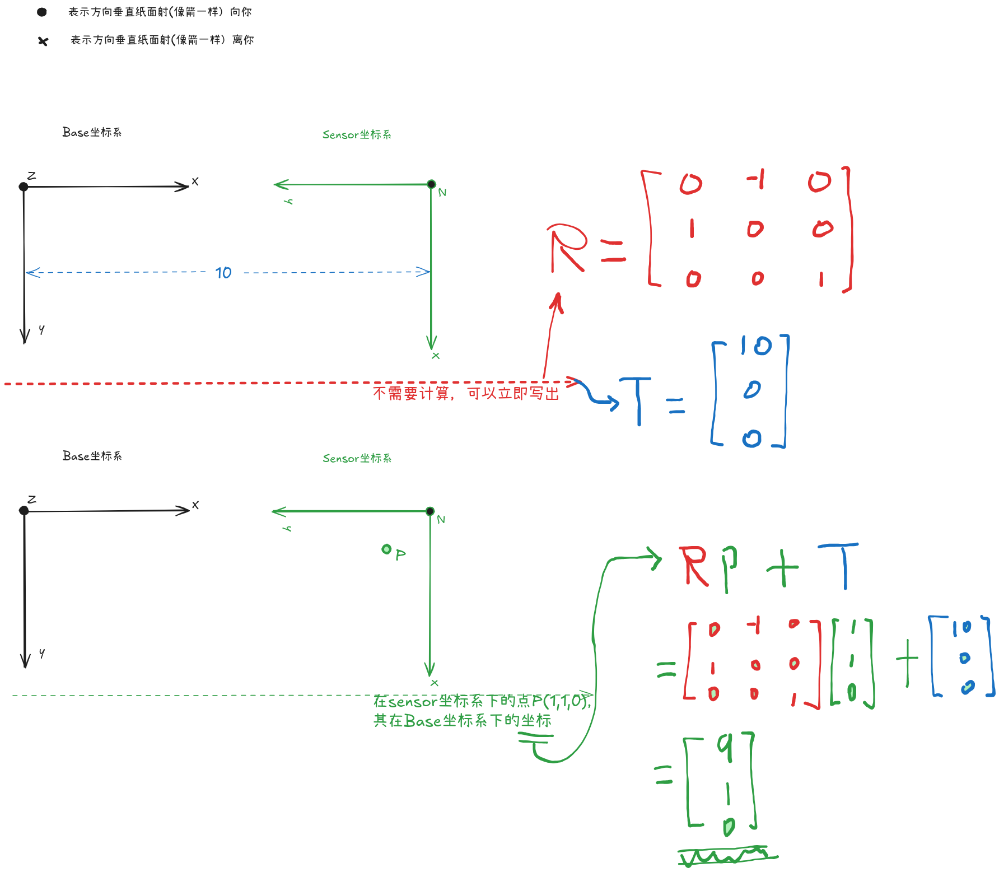

## 背景
这篇文章不讲标定的原理，而是关注与标定结果的使用，以及标定结果的直观理解---可以快速识别标定结果的定性上的错误。不再对左乘，右乘，是否取逆矩阵犯迷糊。

### 外参
如图所示，Base坐标系一般是一个基准坐标系；sensor坐标系为传感器坐标系；图中给了一个理想的情况，便于分析问题；实际中大部分传感器也都是水平或者垂直放置，但是仍有一定的角度；  
**1** 这样的理想情况你必须可以直接写出旋转矩阵，其实很简单，按列写，第一列便是Sensor坐标系的X轴在Base坐标系下的方向，依次第二列是y轴，然后第三列是z轴；平移矩阵就更好确定了，
就是sensor坐标系的原点在base坐标下的实际坐标。**有了这两点在日常标定中，便可以快速的对标定的结果进行正确性的定性上的分析**

**2** 就是标定结果的使用了，图中给出P点在sensor坐标系下的坐标点(1,1,0) 也符合实际，传感器测出的原始数据一般都是在sensor坐标系下；然后左乘旋转矩阵再加上平移矩阵便得到了当前点在
base坐标系下的坐标了。也可以直接在图中验证结果的正确性，毕竟P点在Base坐标系下的坐标一眼就看出来了。
