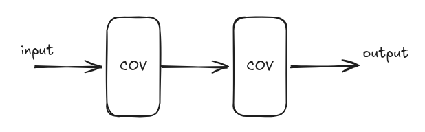
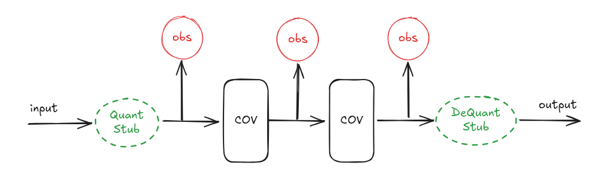
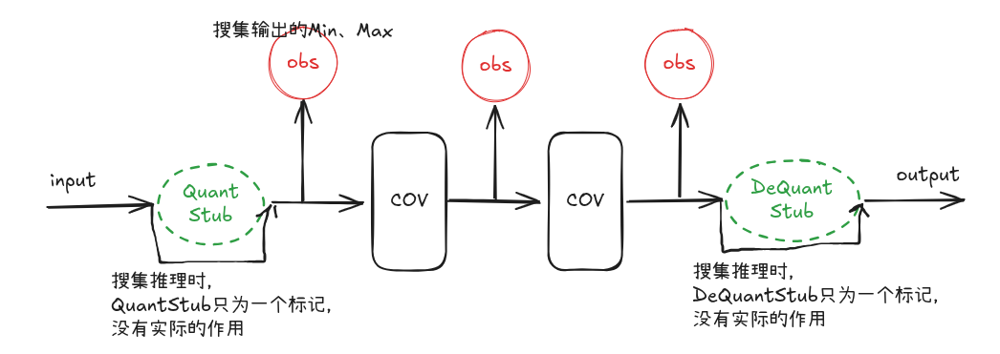
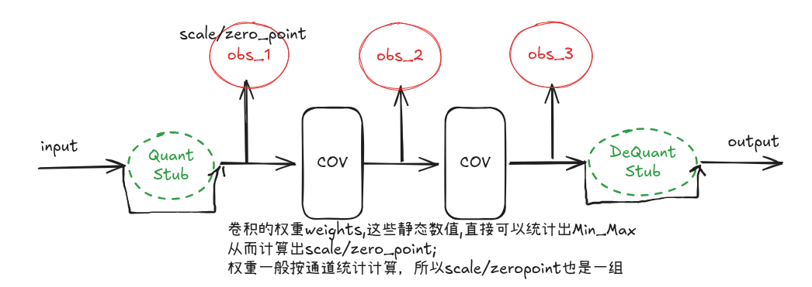
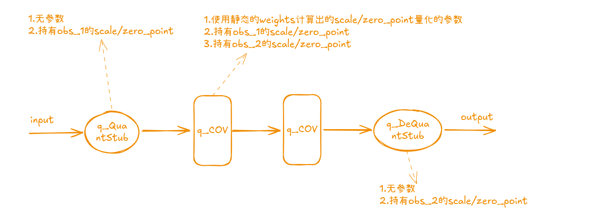
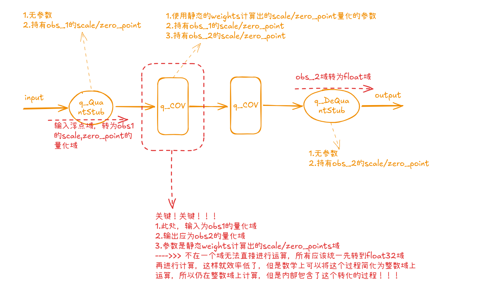

## 背景

对于模型的PTQ，几乎所有的平台都是**三板斧**，感觉自己理解起其中大致的过程和原理，但是细琢磨总感觉哪里还是差一点，没法完全的自圆其说。这次借助Pytorch的**Hook**技术对PTQ的过程做了详细的调试，把整个PTQ的流程以一个**小模型**为例子说明；这会是真的豁然开朗，之前的理解果然还是差了一点。

## Pytorch(1.16.0)PTQ详细流程

### 1 .  原始模型说明
以一个小模型两个卷积层串联为例子。

### 2. QuantStub、DeQuantStub和Min_Max Observer节点的插入
QuantStub、DequantStub节点的插入需修改模型的forward()函数，Min_Max Obs是在准备量化模型的时候，Pytorch系统自动插入。

### 3 . 前向推理，Obs节点数据收集与统计
准备完需要量化的模型之后，可对这个模型进行前向推理，插入的Min_Max Obs 会自动收集每次前向推理的数据。

### 4. 进行模型转换01---量化参数计算
插入的QauntStub和DequantStub这时候是一个标志，前向推理的时候没有任何影响；插入的Obs节点搜集到激活值的Min_Max；根据这个值便可以计算出对应的scale、zero_point；卷积层也有模型的weights，由于weights在模型训练之后就是固定了静态值了，所以可以直接得到Min，Max值然后得到对应的scale、zero_point。

### 5. 进行模型转换02---转为量化模型
这里有一个关键的概念：***Pytorch转为量化模型之后那么所有的计算就全部切换到量化域了，量化域和默认的float32域是两套完全隔离的计算引擎。***

### 6. 量化模型推理
这里的关键就是进行计算之前，必须要保证所有的数据都在***相同的域***：float32域，每个不同的scale和zero_point都是不同的域。
