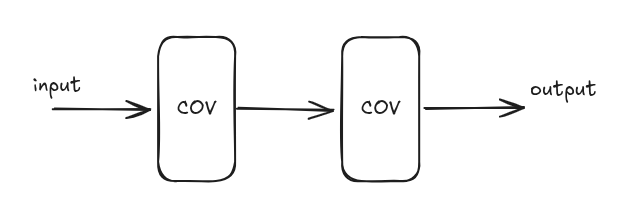
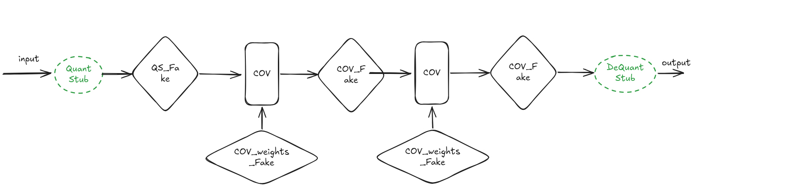
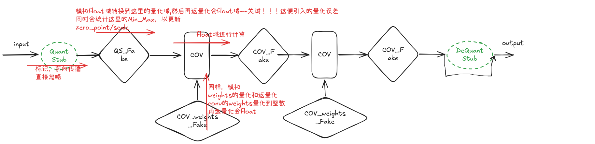
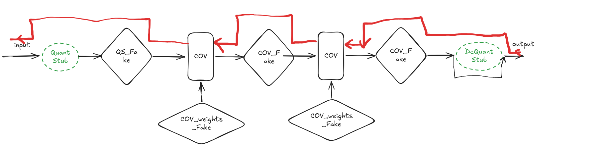

## 背景

文章[PTQ详细流程](posts/ptq-detailed-flow)对于模型量化的原理和流程进行了详细的说明，一般简单模型PTQ流程已经足够使用了，对于PTQ精度掉点太大的模型；就需要使用QAT了。
QAT的核心原理就是在训练的时候，通过插入伪量化节点，将量化的误差引入到损失函数，从而得到在存在量化误差的情况下，使得损失函数最小的模型参数。

## Pytorch(1.16.0)PTQ详细流程

### 1 .  原始模型说明
以一个小模型两个卷积层串联为例子。

### 2. QuantStub、DeQuantStub和FakeQuant节点的插入
QuantStub、DequantStub节点的插入需修改模型的forward()函数，FakeQuant节点是在准备量化模型的时候，Pytorch系统自动插入，这就必须保证你的模型中使用的Module是Pytorh支持的，若不支持，及不知道如何插入对应的FakeQuant就需要手动进行修改，这个后续说明。注意：FakeQunat不仅仅只是针对激活值，对于权重也是如此。每个FakeQunat中都会有一个Obs节点，用于收集和统计Min_Max值，用于后续计算scale和zero_point。

### 3 . QAT前向推理，模拟量化损失
每个插入的FakeQuant节点，在QAT前向推理的时候，都会先进行**量化，然后在进行饭量化，这变引入的量化误差，你可以自己用一个scale和zero_point试一下**，然后继续进行前向传播，这样结果就包含了量化误差。

### 4. QAT反向传播，更新模型参数
QAT的反向传播，和原始模型的反向传播是一样的，因为前向传播在建立计算图的时候就没有包含FakeQuant、QuantStub、DeQuantStub节点，所以反向传播的时候，就直接按照原始模型的反向传播进行。

### 5. 结果保存
QAT训练结束后，一般是仅保存模型的参数，而不是整个模型，因为实际部署的平台未必支持QuantStub、DequantStub和FakeQuant等节点、原始算子的量化版本算子。