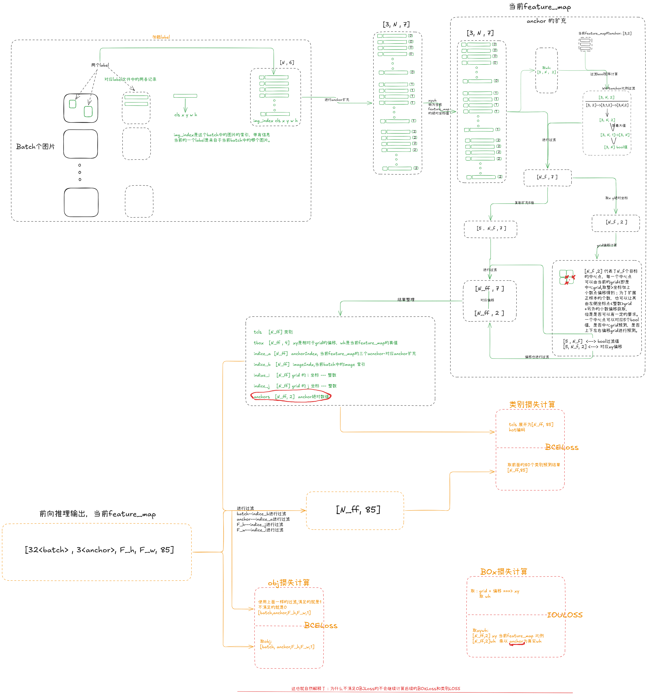

## 背景
之前对Yolo系列的损失函数基本都是论文了解和博客阅读，一直没有从**源码**进行理解过，这次追踪了yolov5训练过程中的lable数据的流动过程，以及如何与yolo训练输出的tensor计算最后的损失函数的详细流程；果然源码还是可以带来更深刻的理解。

### 1 . 数据流详细流程

label数据的流程的复杂来自于数据的扩充<解决正样本个数太少的问题>；分别是两次扩从一次是anchor的扩充，一次是偏移的扩充。
