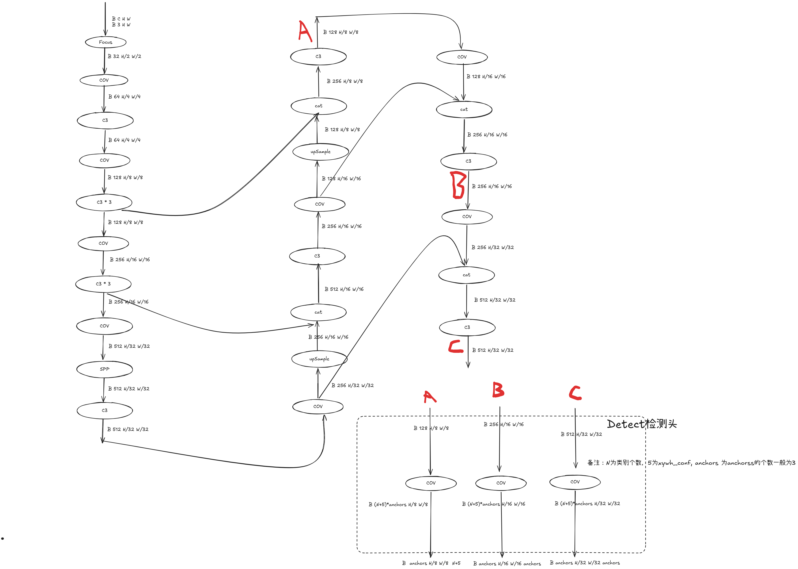

## 背景
最近有个想法[github](https://github.com/Richard149/SimModel)，想将常见的模型从Utralytics、MMDet3D等框架中抽取出来，仅使用pytorch做朴素的实现。顺带产出一些博客。

### 1 . YOLOv5s模型结构
之前的一篇博客对**YOLOv5的LOSS**做了源码级别的理解，LOSS输入的模型的输出tensor可以参照这里的图示。

